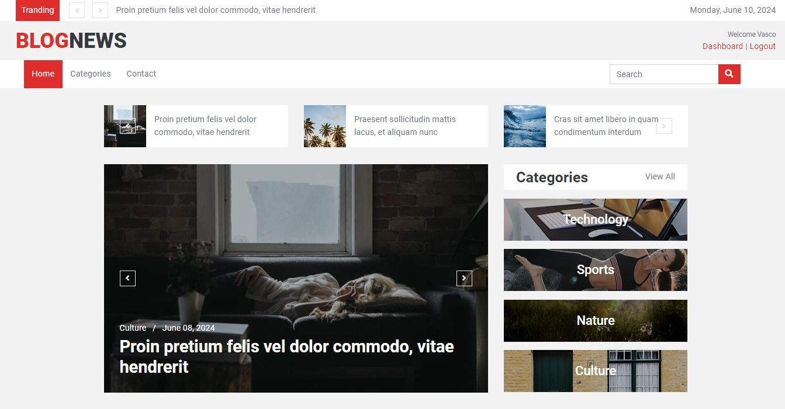
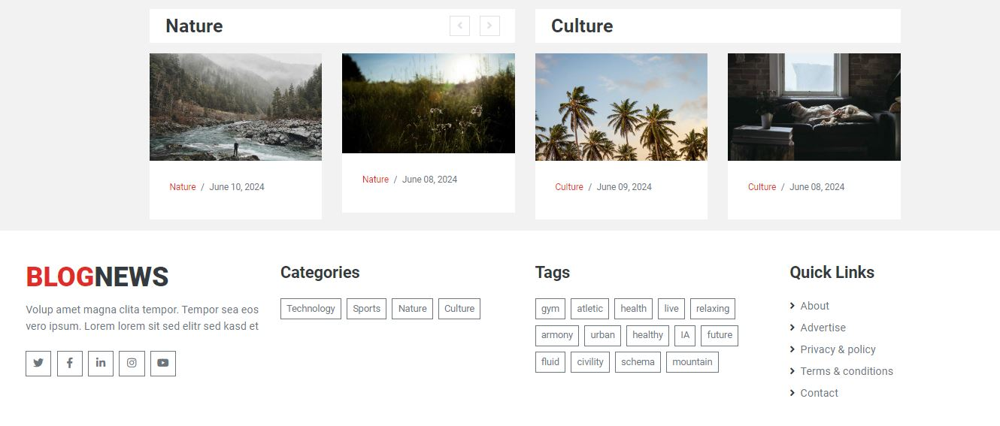

# Blog News

Hola a todos 👋,

Comparto este proyecto de un blog de noticias, espero les sea útil.

## Tecnologías

[](https://skillicons.dev)

[](https://choosealicense.com/licenses/mit/)
[](https://github.com/EmanuelCG/django-blog "Go to GitHub repo")

## Screenshots





## Instalación

1. Clona el repositorio:

    ```bash
    git clone https://github.com/EmanuelCG/django-blog.git
    ```

2. Ve al directorio del proyecto:

    ```bash
    cd tu_proyecto
    ```

3. Instala las dependencias:

    ```bash
    pip install -r requirements.txt
    ```

## Uso

1. Configura tu entorno virtual y activa tu entorno.
2. Ejecuta el servidor de desarrollo:

    ```bash
    python manage.py runserver
    ```

3. Abre tu navegador web y visita `http://localhost:8000` para ver la aplicación en funcionamiento.

## Contribución

Si quieres contribuir a este proyecto, sigue estos pasos:

1. Haz un fork del proyecto.
2. Crea una nueva rama (`git checkout -b feature/nueva-funcionalidad`).
3. Haz tus cambios y haz commit (`git commit -am 'Agrega una nueva funcionalidad'`).
4. Haz push a la rama (`git push origin feature/nueva-funcionalidad`).
5. Crea un pull request.

## Créditos

Template: <https://htmlcodex.com/template/> <br>
Images: <https://picsum.photos/> <br>
Loader efect: <https://codepen.io/ispal>
